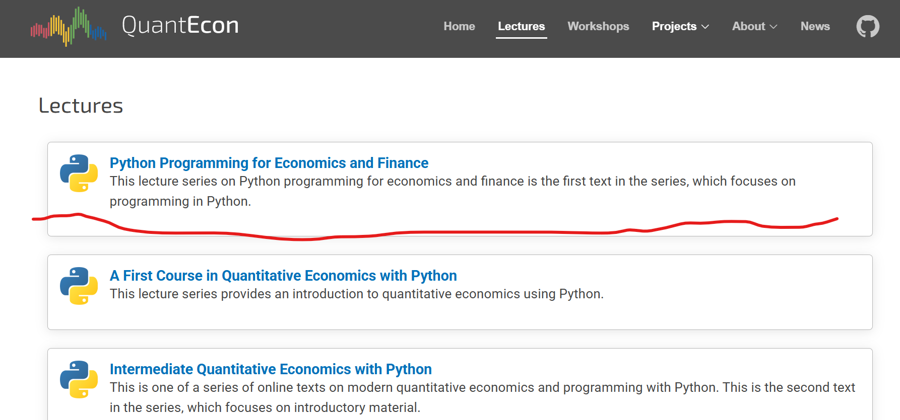

##  QuantEcon

1. We will use QuantEcon from Sargent for our Python Basics study  

Lecture: https://python-programming.quantecon.org/intro.html  

  

   
2. Codes for our first part class  
https://github.com/QuantEcon/lecture-python-programming.notebooks

