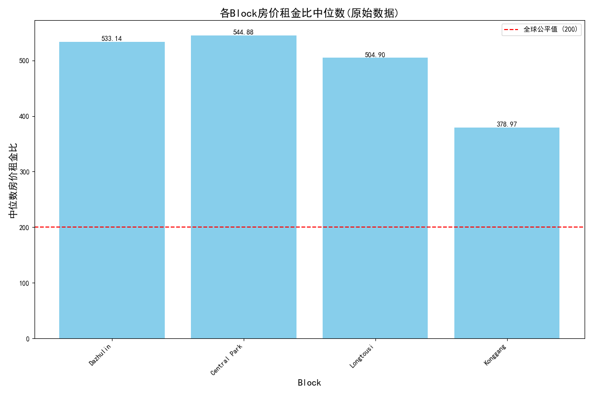
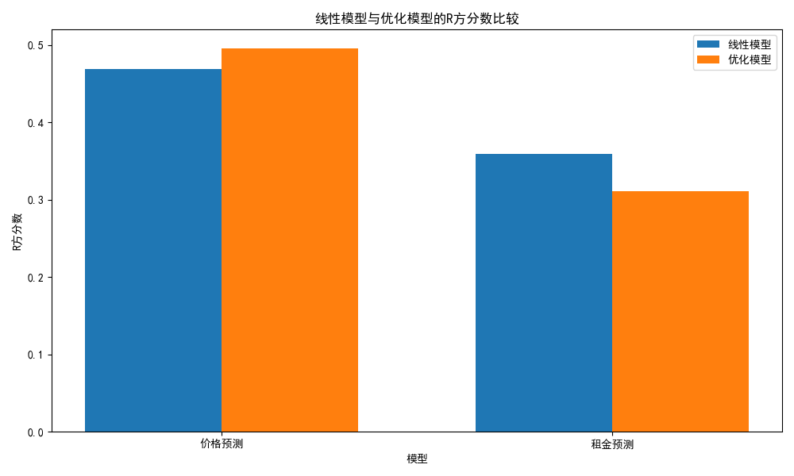

# 房产数据分析作业报告 - 唐子云 2023200198

## 1. 数据爬取

使用`scrape_sale.ipynb`和`scrape_rental.ipynb`分别爬取了房产销售和租赁数据。

- 销售数据来源：https://cq.esf.fang.com/house-a058-b04846/
- 租赁数据来源：https://cq.zu.fang.com/house-a058-b04846/

输出结果：
- 销售数据：`Longtousi_sale_data_20pages.parquet`
- 租赁数据：`Longtousi_rental_data_20pages.parquet`

## 2. 小组数据合并

小组成员分别选取了不同Block的房产数据：`龙头寺`、`大竹林`、`空港`、`中央公园`。将所有数据放到文件夹`data/`下，每个区域的数据文件如下：
- 龙头寺：`Longtousi_sale_data_20pages.parquet`和`Longtousi_rental_data_20pages.parquet`
- 大竹林：`dazhulin_sale.parquet`和`dazhulin_rent.parquet`
- 空港：`konggang_housing_price.parquet`和`konggang_housing_rent.parquet`
- 中央公园：`Centralpark_sale_data_revised.parquet`和`CentralPark_rental_data_revised.parquet`

接着，使用`merge_data.ipynb`合并各Block数据：
- 销售数据：`merged_sale_data.parquet`
- 租赁数据：`merged_rental_data.parquet`

## 3. Data Research

代码文件：`data_analysis.ipynb`

### 3.1 数据分析和预处理
使用 **IQR方法** 检测离群值并将其剔除。

代码输出结果如下：
```
============================================================
销售数据描述
============================================================
数据形状: (4454, 3)

列信息:
<class 'pandas.core.frame.DataFrame'>
RangeIndex: 4454 entries, 0 to 4453
Data columns (total 3 columns):
 #   Column  Non-Null Count  Dtype  
---  ------  --------------  -----  
 0   Area    4454 non-null   object 
 1   Price   4454 non-null   float64
 2   Block   4454 non-null   object 
dtypes: float64(1), object(2)
memory usage: 104.5+ KB
None

数值列统计:
              Price
count  4.454000e+03
mean   1.397153e+06
std    7.418474e+05
min    1.850000e+05
25%    8.200000e+05
50%    1.250000e+06
75%    1.800000e+06
max    3.700000e+06

Block分布:
Block
Konggang        1199
Longtousi       1148
Central Park    1074
Dazhulin        1033
Name: count, dtype: int64

============================================================
租赁数据描述
============================================================
数据形状: (3109, 3)

列信息:
<class 'pandas.core.frame.DataFrame'>
RangeIndex: 3109 entries, 0 to 3108
Data columns (total 3 columns):
 #   Column  Non-Null Count  Dtype  
---  ------  --------------  -----  
 0   Area    3109 non-null   object 
 1   Rent    3109 non-null   float64
 2   Block   3109 non-null   object 
dtypes: float64(1), object(2)
memory usage: 73.0+ KB
None

数值列统计:
              Rent
count  3109.000000
mean   2158.876166
std     794.241919
min     130.000000
25%    1500.000000
50%    2100.000000
75%    2600.000000
max    4600.000000

Block分布:
Block
Central Park    1156
Longtousi       1137
Konggang         498
Dazhulin         318
Name: count, dtype: int64
检测到的Price离群值数量: 98/4454
离群值比例: 2.20%
Price范围: -650000.00 - 3270000.00
销售价格离群值样例:
         Price    Area         Block
145  3650000.0   183.0  Central Park
150  3680000.0   363.0  Central Park
163  3650000.0   183.0  Central Park
179  3300000.0  165.11  Central Park
209  3500000.0  196.03  Central Park
检测到的Rent离群值数量: 27/3109
离群值比例: 0.87%
Rent范围: -150.00 - 4250.00
租金离群值样例:
       Rent Area         Block
19   4300.0  129  Central Park
98   4500.0  100  Central Park
199  4500.0  100  Central Park
243  4500.0  143  Central Park
276  4600.0  143  Central Park
```

剔除离群值后的数据文件如下：
- 销售数据：`filtered_sale_data.parquet`
- 租赁数据：`filtered_rental_data.parquet`

## 3.2 Figure A - 原始数据


## 4. 模型建立与评估

### 4.1 线性模型 (Model 1 和 Model 2)

建立线性模型如下：
- **Model 1**: $$\frac{\text{price}}{\text{Area}_i} = \beta_0 \cdot \text{Area}_i + \sum_{i=1}^{k} (\beta_i \cdot \text{Block}_i) + \varepsilon$$
- **Model 2**: $$\frac{\text{rent}}{\text{Area}_i} = \beta_0 \cdot \text{Area}_i + \sum_{i=1}^{k} (\beta_i \cdot \text{Block}_i) + \varepsilon$$

模型代码采用Pipeline结构，包括：
1. 对Block特征进行OneHotEncoder编码
2. 使用LinearRegression进行回归分析

### 4.2 优化模型 (Model 1+ 和 Model 2+)

在原有线性模型基础上添加了非线性特征和交互项：
- **Model 1+**: $$\frac{\text{price}}{\text{Area}_i} = \beta_0 + \sum_{i=1}^{k} (\beta_i \cdot \text{Block}_i) + 
          \beta_{k+1} \cdot \text{Area}_i + \beta_{k+2} \cdot \text{Area}_i^2 + 
          \sum_{i=1}^{k} (\gamma_i \cdot \text{Block}_i \cdot \text{Area}_i) + 
          \sum_{i=1}^{k} (\delta_i \cdot \text{Block}_i \cdot \text{Area}_i^2) + \varepsilon$$
- **Model 2+**: $$\frac{\text{rent}}{\text{Area}_i} = \beta_0 + \sum_{i=1}^{k} (\beta_i \cdot \text{Block}_i) + 
          \beta_{k+1} \cdot \text{Area}_i + \beta_{k+2} \cdot \text{Area}_i^2 + 
          \sum_{i=1}^{k} (\gamma_i \cdot \text{Block}_i \cdot \text{Area}_i) + 
          \sum_{i=1}^{k} (\delta_i \cdot \text{Block}_i \cdot \text{Area}_i^2) + \varepsilon$$

非线性模型通过PolynomialFeatures(degree=2)实现，创建包含面积平方和面积与Block交互的新特征，以捕捉数据中的复杂关系。

### 4.3 模型评估结果

模型评估结果如下：
```
============================================================
评估模型性能
============================================================

Model 1 模型评估:
R² 分数: 0.4693
均方根误差 (RMSE): 3148.13

Model 2 模型评估:
R² 分数: 0.3591
均方根误差 (RMSE): 6.72

Model 1+ 模型评估:
R² 分数: 0.4955
均方根误差 (RMSE): 3069.47

Model 2+ 模型评估:
R² 分数: 0.3108
均方根误差 (RMSE): 6.96
```



```
============================================================
R²分数比较分析
============================================================
模型 1+ 的R²分数(0.4955)高于模型 1 (0.4693)。
这可能是因为price与area之间存在非线性关系，通过添加非线性特征和交互项，模型能够捕捉到不同block之间更复杂的数据模式。
模型 2+ 的R²分数(0.3108)低于或等于模型 2 (0.3591)。
这可能是因为rent与area之间的关系基本上是线性的，或者添加的非线性特征导致了过拟合。
```
由结果可知，预测房价更准确的模型是Model 1+，而预测租金更准确的模型是Model 2。

### 4.4 Figure B - Model 1 & Model 2

.png)

### 4.5 Figure C - Model 1+ & Model 2+

.png)

### 4.6 对比不同method的price to rent ratio

- 使用预测模型估计**price to rent ratio**时使用了销售数据与租赁数据的混合预测数据，数据样本量大
- 使用原始数据计算**price to rent ratio**时price和rent是分开的，可能会对结果产生影响

因此，对于**price to rent ratio**的计算，使用模型进行预测应更为可信

而对于线性模型和优化模型，由于两种模型在拟合price和rent时各有优劣，因此在计算**price to rent ratio**时，应使用线性模型预测price，优化模型预测rent，以获得更准确的结果。

## 5. 附录

### 5.1 文件列表

- `scrape_sale.ipynb`: 销售数据爬取脚本
- `scrape_rental.ipynb`: 租赁数据爬取脚本
- `merge_data.ipynb`: 数据合并脚本
- `data_analysis.ipynb`: 数据处理与分析脚本

### 5.2 图表列表

- `r2_comparison_chart.png`: 线性模型与优化模型的R²分数比较图
- `block_price_to_rent_ratio_median_original.png`: Figure A - 各Block房价租金比中位数(原始数据)
- `block_price_to_rent_ratio_median_(线性模型).png`: Figure B - 各Block房价租金比中位数（线性模型）
- `block_price_to_rent_ratio_median_(优化模型).png`: Figure C - 各Block房价租金比中位数（优化模型）
